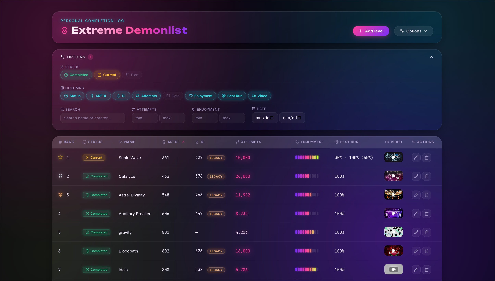
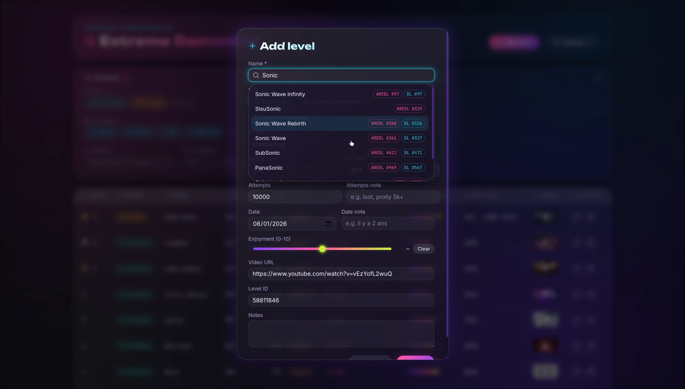

<div align="center">

# 💀 Extreme Tracker

### A neon-soaked completion tracker for Geometry Dash's hardest levels

[](https://github.com/TLacault/extreme-tracker/actions/workflows/deploy.yml)


[](LICENSE)

## **[▶ LIVE APP](https://tlacault.github.io/extreme-tracker/)**



</div>


Extreme Tracker is a personal completion log for Geometry Dash extreme demons — the levels that separate the mortals from the legends. Track what you've beaten, what you're grinding, and what you're too scared to start, with live AREDL/DL rank sync, a searchable add-level flow that autofills itself, and a dark, glowing UI that actually looks like it belongs on a demon list.

Everything runs client-side. No account, no backend, no tracking — your data lives in your browser and travels with you via one-click JSON export/import.

---

## ✨ Features

### 🔍 Add a level without typing a single extra field
Start typing a level name and get live suggestions straight from the AREDL/DL databases. Pick one and the form autofills the AREDL rank, DL rank, creator, video URL, and level ID for you — no alt-tabbing to look anything up.



### 🏆 A ranking table that flexes
> Sortable by AREDL rank, DL rank, attempts, date, or enjoyment. Top 3 placements get crown/medal icons, DL-ranked levels get **Main / Extended / Legacy** tier badges, and attempt counts light up with an escalating heat glow the more soul-crushing a level gets (5k, 10k+... you know who you are).

### 🎯 Status tracking & Attempts count
> Every level is **Completed**, **Currently Completing**, or **Planned** — and that status uses the exact same green / amber / violet color language across the table, the filters, and the edit form, so you always know what you're looking at at a glance.

### 🛠️ A fully configurable Table
> One collapsible panel to rule them all: filter by status, search by name or creator, range-filter attempts/enjoyment/date — and toggle **any column on or off** to build the exact table you want. Your layout preference is remembered across sessions.

### 🔄 Auto-refreshing ranks
> On load (and once a day after that), AREDL and Pointercrate DL positions refresh automatically in the background, so your list never goes stale.

### 🎥 Built-in video playback
Click any level's video thumbnail to watch the completion clip in an embedded player, right there in the table — no new tab required.

### 💾 Local-first, zero lock-in
Every level lives in `localStorage`. Export your whole list to JSON for backup or sharing, import it back anytime, or wipe everything and start fresh — it's your data, your rules.

---

## 🧱 Tech stack

- **[Vue 3](https://vuejs.org/)** + `<script setup>` — reactive UI, no fluff
- **TypeScript** — end to end
- **[Vite](https://vitejs.dev/)** — dev server & build
- **[Vitest](https://vitest.dev/)** — unit tests
- **[Lucide](https://lucide.dev/)** — icon set
- Deployed to **GitHub Pages** on every push to `main`

## 🚀 Development

```bash
npm install
npm run dev      # start the dev server
npm test         # run the Vitest suite
npm run build    # type-check and build for production
```

See [`docs/ARCHITECTURE.md`](docs/ARCHITECTURE.md) for how the app is put together.

## 🤝 Contributing

Bug reports, feature requests, and pull requests are welcome — see
[`CONTRIBUTING.md`](CONTRIBUTING.md) for how to fork, set up the project
locally, and submit a PR.
